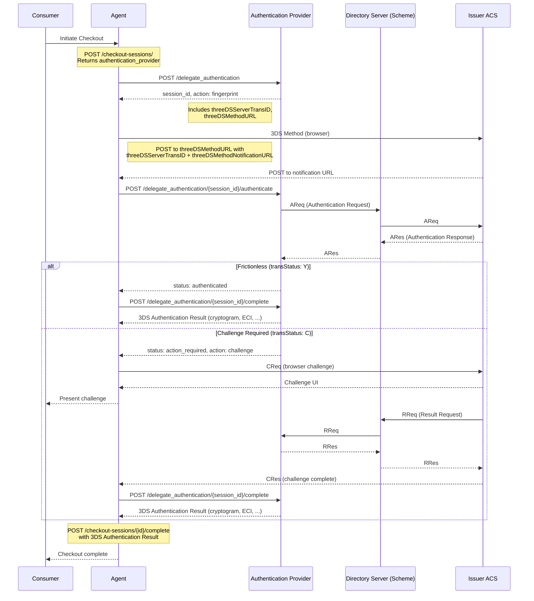

# SEP #79: Delegated Authentication API Proposal (Session-Based)

## Overview

This document proposes universal `delegate_authentication` endpoints for the Agentic Commerce Protocol, enabling merchants to specify their preferred 3DS authentication provider while maintaining parallel execution for optimal latency.

This version uses a **fully session-based** design with the session ID in the URL path, consistent with the Agentic Checkout API pattern.

### Scope

This specification covers:
- **3D Secure 2** (3DS2) authentication only
- **Browser channel** only (not app/SDK)
- **Native integration** (agent handles fingerprint/challenge flows, not redirect-based)

---

## Design Principles

### Session-Based State Management

The API uses server-side sessions identified by an opaque `session_id`. The session ID is:
- Returned in the `POST /delegate_authentication` response
- Included in the URL path for all subsequent requests
- Used by the provider to maintain authentication state server-side

This mirrors the checkout session pattern (`/checkout_sessions/{id}`), providing a consistent developer experience across the protocol.

### Three-Endpoint Design

```
POST /delegate_authentication
  -> Initialize authentication session, get session_id and action (fingerprint/none)

POST /delegate_authentication/{session_id}/authenticate
  -> Submit 3DS Method result (Y/N/U)
  -> Returns next status and action (authenticated/action_required/failed)

POST /delegate_authentication/{session_id}/complete
  -> Retrieve 3DS authentication result (cryptogram, eci, ds_trans_id, etc.)
  -> After challenge: include challenge_result (transStatus from CRes)
```

**Simplified Flow:**
- Frictionless: `POST /delegate_authentication` -> `/{id}/authenticate` (fingerprint) -> `/{id}/complete`
- Challenge: `POST /delegate_authentication` -> `/{id}/authenticate` (fingerprint) -> browser challenge -> `/{id}/complete`

After a challenge, the agent must pass the `challenge_result` (transStatus from CRes) to `/complete`.

---

## High-Level Authentication Flow



---

## API Specification

### POST /delegate_authentication

Initialize a 3DS authentication session. This performs enrollment check and returns fingerprint action if supported.

**Request:**
```json
{
  "merchant_id": "merchant_abc123",
  "payment_method": {
    "type": "card",
    "number": "4917610000000000",
    "exp_month": "03",
    "exp_year": "2030",
    "name": "Jane Doe"
  },
  "amount": {
    "value": 1000,
    "currency": "EUR"
  }
}
```

**Response (fingerprint required):**
```json
{
  "id": "auth_session_abc123",
  "status": "action_required",
  "action": {
    "type": "fingerprint",
    "fingerprint": {
      "three_ds_method_url": "https://acs.issuer.com/3dsmethod",
      "three_ds_server_trans_id": "abc-123-def"
    }
  }
}
```

**Response (no action needed):**
```json
{
  "id": "auth_session_abc123",
  "status": "pending"
}
```

**Response (not supported):**
```json
{
  "id": "auth_session_abc123",
  "status": "not_supported",
  "reason": "card_not_enrolled"
}
```

**Possible status values:**
- `action_required` - Process the `action` object (fingerprint)
- `pending` - No action needed, call `/{id}/authenticate` directly
- `not_supported` - Authentication not supported (card not enrolled, issuer not participating, etc.) - proceed to authorization without 3DS

---

### POST /delegate_authentication/{session_id}/authenticate

Submit the result of the fingerprint action along with browser and transaction details. This triggers the Authentication Request (AReq) to the Directory Server.

**Request:**
```json
{
  "fingerprint_completion": "Y",
  "reference": "order_123",
  "channel": "browser",
  "browser_info": {
    "user_agent": "Mozilla/5.0 (Windows NT 10.0; Win64; x64)...",
    "accept_header": "text/html,application/xhtml+xml...",
    "language": "en-US",
    "color_depth": 24,
    "screen_height": 1080,
    "screen_width": 1920,
    "timezone_offset": 0,
    "java_enabled": false,
    "javascript_enabled": true
  },
  "challenge_notification_url": "https://agent.example.com/3ds/challenge-callback",
  "ip_address": "192.168.1.1",
  "billing_address": {
    "name": "Jane Doe",
    "line_one": "123 Main Street",
    "line_two": "Apt 4B",
    "city": "Amsterdam",
    "state": "NH",
    "country": "NL",
    "postal_code": "1012 AB"
  },
  "shopper_email": "shopper@example.com"
}
```

**Response (frictionless - authenticated):**
```json
{
  "id": "auth_session_abc123",
  "status": "authenticated"
}
```

**Response (challenge required):**
```json
{
  "id": "auth_session_abc123",
  "status": "action_required",
  "action": {
    "type": "challenge",
    "challenge": {
      "acs_url": "https://acs.issuer.com/challenge",
      "acs_trans_id": "xyz-789",
      "three_ds_server_trans_id": "abc-123-def",
      "message_version": "2.2.0"
    }
  }
}
```

**Possible status values:**
- `authenticated` - Authentication successful (frictionless)
- `action_required` - Process the `action` object (challenge)
- `attempted` - Proof of authentication attempt provided
- `not_authenticated` - Authentication failed
- `rejected` - Issuer rejected, do not attempt authorization
- `unavailable` - Technical error

For all statuses, agent proceeds to `/{id}/complete` to retrieve the full 3DS authentication result.

---

### POST /delegate_authentication/{session_id}/complete

Always called to retrieve the 3DS authentication result.

**Response (authenticated):**
```json
{
  "id": "auth_session_abc123",
  "status": "authenticated",
  "authentication_result": {
    "trans_status": "Y",
    "eci": "05",
    "cryptogram": "AQIDBAUGBwgJCgsMDQ4PEBESExQ=",
    "ds_trans_id": "c4e59ceb-a382-4d6a-bc87-385d591fa09d",
    "three_ds_server_trans_id": "6edcc246-23ee-4e94-ac5d-8ae620bea7d9",
    "message_version": "2.2.0",
    "authentication_value": "CAVV_VALUE"
  }
}
```

**Response (not authenticated):**
```json
{
  "id": "auth_session_abc123",
  "status": "not_authenticated",
  "authentication_result": {
    "trans_status": "N",
    "trans_status_reason": "01",
    "eci": "07",
    "ds_trans_id": "3022b509-391e-4c25-a225-f37e062843a5",
    "three_ds_server_trans_id": "87a357a1-faee-4cd1-b3cf-ea2c704bf073",
    "message_version": "2.2.0",
    "cardholder_info": "Please contact your bank's customer support."
  }
}
```

**Response (rejected):**
```json
{
  "id": "auth_session_abc123",
  "status": "rejected",
  "authentication_result": {
    "trans_status": "R",
    "trans_status_reason": "12",
    "ds_trans_id": "385140e5-b9d2-42d0-ace8-3135a1c0aa2b",
    "three_ds_server_trans_id": "521a73c2-337b-434a-8f91-f5b19de09ebd",
    "message_version": "2.2.0"
  }
}
```

**Possible status values:**
- `authenticated` - Authentication successful
- `attempted` - Proof of authentication attempt provided
- `not_authenticated` - Authentication failed
- `rejected` - Issuer rejected, do not attempt authorization
- `unavailable` - Technical error retrieving result

The `authentication_result` object is returned for all terminal statuses except `unavailable`. Fields are populated based on availability from the authentication response.

---

## Action Object

The `action` field is an optional object that describes what client-side browser work is required. When present, it contains a `type` discriminator and a corresponding data object.

When no action is needed, the `action` field is **omitted entirely**.

All API calls (`/{id}/authenticate`, `/{id}/complete`) are made by the agent's **server**, not the browser.

| Endpoint          | Action Type    | Meaning                                                                                    |
|-------------------|----------------|--------------------------------------------------------------------------------------------|
| `POST /delegate_authentication` | `fingerprint`  | Browser does fingerprint, ACS calls notification URL, agent server calls `/{id}/authenticate` |
| `POST /delegate_authentication` | _(omitted)_    | No fingerprint needed, agent server calls `/{id}/authenticate` directly with `U`            |
| `/{id}/authenticate` | `challenge`    | Browser does challenge, ACS calls notification URL, agent server calls `/{id}/complete`     |
| `/{id}/authenticate` | _(omitted)_    | Frictionless success, agent server calls `/{id}/complete` directly                          |

### `fingerprint` Action

Returned by `POST /delegate_authentication` when the issuer's ACS supports device fingerprinting.

```json
{
  "action": {
    "type": "fingerprint",
    "fingerprint": {
      "three_ds_method_url": "https://acs.issuer.com/3dsmethod",
      "three_ds_server_trans_id": "abc-123-def"
    }
  }
}
```

| Field                      | Description                                         |
|----------------------------|-----------------------------------------------------|
| `three_ds_method_url`       | URL to POST to in hidden iframe                     |
| `three_ds_server_trans_id` | 3DS Server transaction ID to include in the payload |

**Agent constructs the payload:**
```json
{
  "threeDSServerTransID": "<three_ds_server_trans_id>",
  "threeDSMethodNotificationURL": "https://agent.example.com/3ds/fingerprint-callback"
}
```
Base64 encodes it, POSTs as `threeDSMethodData` to `three_ds_method_url`.

**Flow:**
1. Browser loads hidden iframe, POSTs `threeDSMethodData` to `three_ds_method_url`
2. ACS collects device fingerprint
3. ACS POSTs to `threeDSMethodNotificationURL` (agent's server)
4. Agent server calls `/{id}/authenticate` with `fingerprint_completion: Y` (or `N` on timeout)
5. Agent server returns HTML with `postMessage` to notify browser

### `challenge` Action

Returned by `/{id}/authenticate` when the issuer requires cardholder verification.

```json
{
  "action": {
    "type": "challenge",
    "challenge": {
      "acs_url": "https://acs.issuer.com/challenge",
      "acs_trans_id": "xyz-789",
      "three_ds_server_trans_id": "abc-123-def",
      "message_version": "2.2.0"
    }
  }
}
```

| Field                      | Description                          |
|----------------------------|--------------------------------------|
| `acs_url`                  | URL to POST the challenge request to |
| `acs_trans_id`             | ACS transaction identifier           |
| `three_ds_server_trans_id` | 3DS Server transaction identifier    |
| `message_version`          | 3DS protocol version (e.g., "2.2.0") |

**Agent constructs the CReq:**
```json
{
  "threeDSServerTransID": "<three_ds_server_trans_id>",
  "acsTransID": "<acs_trans_id>",
  "messageVersion": "<message_version>",
  "messageType": "CReq",
  "challengeWindowSize": "05"
}
```
Base64 encodes it (no padding), POSTs as `creq` to `acs_url`.

**Flow:**
1. Browser renders iframe/modal, POSTs `creq` to `acs_url`
2. Shopper completes challenge
3. ACS POSTs `CRes` to `challenge_notification_url` (agent's server)
4. Agent decodes CRes, extracts `transStatus`, calls `/{id}/complete` with `challenge_result`
5. Agent server returns HTML with `postMessage` to notify browser

### No Action

When no browser work is required, the `action` field is omitted entirely from the response.

**When omitted:**
- From `POST /delegate_authentication`: ACS doesn't support fingerprinting - agent server calls `/{id}/authenticate` directly with `fingerprint_completion: U`
- From `/{id}/authenticate`: Frictionless success - agent server calls `/{id}/complete` directly

---

### Callback Payloads

**Fingerprint callback** - form POST with:
```
threeDSMethodData=eyJ0aHJlZURTU2VydmVyVHJhbnNJRCI6IjEyMzQ1Njc4LTEyMzQtMTIzNC0xMjM0LTEyMzQ1Njc4OTAxMiJ9
```
Decoded: `{ "threeDSServerTransID": "12345678-1234-1234-1234-123456789012" }`

**Challenge callback** - form POST with:
```
cres=eyJ0cmFuc1N0YXR1cyI6IlkiLCJ0aHJlZURTU2VydmVyVHJhbnNJRCI6IjEyMzQ1Njc4LTEyMzQtMTIzNC0xMjM0LTEyMzQ1Njc4OTAxMiJ9
```
Decoded: `{ "transStatus": "Y", "threeDSServerTransID": "12345678-..." }`


---

## Next Steps

1. Define OpenAPI specification for endpoints
2. Define complete request/response schemas
3. Define error codes and handling
4. Define callback specifications
5. Define provider adapter requirements
